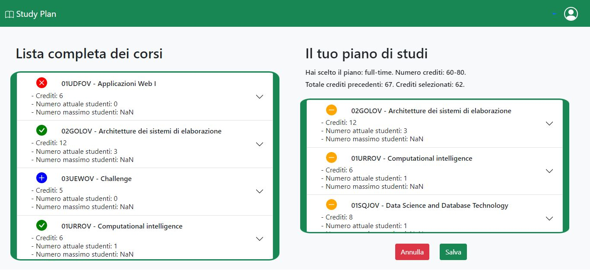

# Exam #1: "Piano di studi"
## Student: s303941 ROTA LUCA  

## React Client Application Routes

- Route `/`: Contenuto: Il layout principale della pagina (MyLayout.js), composto da: navbar (Navbar.js) e lista completa dei corsi (CoursesList.js); Scopo: mostrare il layout principale indipendentemente dall'utente (loggato o meno).

- Route `/home-page`: Contenuto: Aggiunge al layout principale (MyLayout.js) il form per effettuare il login (LoginForm.js); Scopo: visualizzazione che permette ad un utente non loggato di effettuare il login. 

- Route `/home-page-logged-in`: Contenuto: Aggiunge al layout principale (MyLayout.js), la sezione relativa al piano di studi (StudyPlanSection.js), ovvero: il piano di studi dell'utente loggato se esiste (StudyPlan.js), altrimenti aggiunge due bottoni per iniziare la creazione dello stesso (NoStudyPlan.js); Scopo: permettere all'utente loggato di vedere il proprio piano di studi, se esiste, con la possibilità di modificarlo, oppure di iniziare a crearne uno nuovo. 

## API Server

- POST `/api/sessions`
  - request parameters:  _None_
  - request body content: un oggetto contente le credenziali dell'utente che si vuole autenticare 
  {username: luca@gmail.com", password: "0000"}
  - response body content: un oggetto contenente l'informazione dell'utente
  {"id":0,"username":"luca@gmail.com","name":"Luca","totaleCrediti":0,"pianoDiStudi":"","totaleCreditiPrec":0}

- DELETE `/api/sessions/current`
  - request parameters: tramite la sessione si ottiene l'identificativo dell'utente
  - request body content: _None_
  - response body content: _None_

- GET `/api/sessions/current`
  - request parameters: tramite la sessione si ottiene l'identificativo dell'utente
  - request body content: _None_
  - response body content: un oggetto contenente l'informazione dell'utente e alcuni parametri inizializzati a zero
  {"id":0,"username":"luca@gmail.com","name":"Luca","totaleCrediti":0,"pianoDiStudi":"","totaleCreditiPrec":0}

- GET `/api/courses`
  - request parameters: _None_
  - request body content: _None_
  - response body content: un array di oggetti (lista completa dei corsi), ognuno contenente un corso diverso
  [{"codice":"01URSPD","nome":"Internet Video Streaming","crediti":6,"numStudenti":1,"maxStudenti":2,"incompatibilità":null,"propedeuticità":null}, ...]

- GET `/api/studyPlan`
  - request parameters: tramite la sessione si ottiene l'identificativo dell'utente
  - request body content: _None_
  - response body content: un array di stringhe (piano di studi dell'utente), ognuna contenente un codice di corso diverso
  [{"codice":"03UEWOV"},{"codice":"01URROV"},{"codice":"02GOLOV"}, ...]

- POST `/api/createStudyPlan`
  - request parameters : tramite la sessione si ottiene l'identificativo dell'utente
  - request body content: un oggetto, contentente un array di stringhe (contenente i codici che i corsi che compongono il piano di studi) e il tipo di piano di studi selezionato 
  {piano: ["01UDFOV", "02GOLOV", "03UEWOV"], tipoPiano: "part-time"}
  - response body content: _None_

- POST `/api/createStudyPlan`
  - request parameters : tramite la sessione si ottiene l'identificativo dell'utente
  - request body content: _None_
  - response body content: _None_

## Database Tables

- Table `Utenti` - Contenuto: id, nome, email, hash, salt. 
- Table `Corsi` -  Contenuto: codice, nome, crediti, numStudenti, maxStudenti, incompatibilità, propedeuticità.
- Table `PianoDiStudi` - Contenuto: codiceCorso, idUtente.

## Main React Components

- `MyLoginForm` (in `LoginForm.js`): permette all'utente non autenticato di effettuare il login. 

- `MyCoursesList` (in `CoursesList.js`): permette di visuallizare la lista dei corsi completa, marcati in "già aggiunti", "bloccati" e "da aggiungere", quando il piano di studi è presente (quindi con un utente loggato).

- `MyAddedButtons` (in `UpdateButtons.js`): permetteno di marcare visivamente i corsi nella lista, in base al loro stato, rispetto al piano di studi dell'utente e di inserire i corsi nello stesso ove possibile o di generare un messaggio di errore ove non è possibile. 

- `MyNoStudyPlan` (in `NoStudyPlan.js`): permette di iniziare a creare un piano di studi scegliendo se adottare un approccio "part-time" o "full-time".

- `MyStudyPlan` (in `StudyPlan.js`): permette di visualizzare il piano di studi dell'utente e di modificarlo, ovvero: eliminare temporaneamente corsi dallo stesso tramite `MyRemovedButton` (in `UpdateButtons.js`) o di annullare le modfiche effettuate, salvere permanentemente il piano e eliminare permanentemente il piano tramite `MyEditButtons` e `MyDeleteButton` (in `TerminalButton.js`).

## Screenshot

## Users Credentials

- Username: luca@gmail.com; Password: 0000; pianoDiStudi: "full-time". 
- Username: pietro@gmail.com; Password 0000; pianoDiStudi: "part-time".
- Username: fabio@gmail.com; Password 0000; pianoDiStudi: "part-time". 
- Username: mario@gmail.com; Password 0000; pianoDiStudi: "".
- Username: luigi@gmail.com; Password 0000; pianoDiStudi: "".